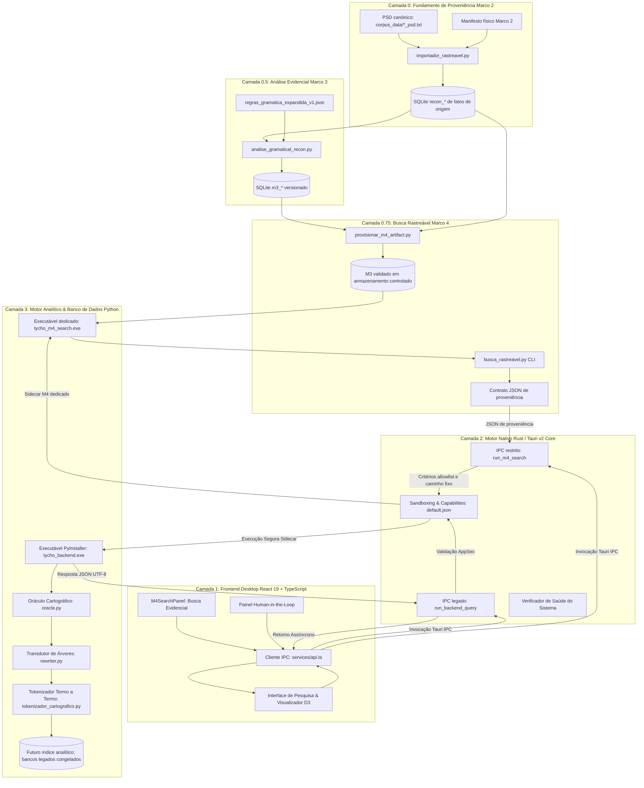

# Arquitetura do Sistema - Tycho Brahe Search

O **Tycho Brahe Search** foi arquitetado como uma aplicação tripartida de alta performance e desacoplamento modular, combinando o ecossistema nativo do **Rust (Tauri v2)**, o poder analítico de **Python (NLP, spaCy, NLTK, SQLite)** e uma interface moderna em **React 19 + TypeScript + Tailwind CSS + D3.js**.

> [!WARNING]
> Este diagrama descreve a arquitetura pretendida e parte da implementação
> existente; não certifica que todos os fluxos estejam operacionais. No Marco
> 2, as fontes PSD são canônicas e a importação de origem é rastreável. No
> Marco 3, há uma camada derivada de evidências gramaticais versionadas; os
> bancos/pacotes legados continuam congelados como derivados experimentais. O
> Marco 4 já fornece uma busca rastreável por CLI sobre um M3 promovido, e o
> Marco 5 a expõe por uma ponte desktop restrita, com sidecar dedicado e
> provisionamento explícito do banco validado. A transdução cartográfica
> completa e a distribuição ainda dependem dos próximos marcos. Consulte
> [STATUS_DE_ARTEFATOS.md](STATUS_DE_ARTEFATOS.md) para o estado verificável.

---

## 1. Diagrama-alvo de camadas

---

## 0. Fundamento de proveniência — Marco 2

Antes de qualquer expansão cartográfica, o importador isolado produz um banco
`recon_*` com todos os grupos físicos PSD, um ledger de decisão para cada
candidato histórico e a topologia fonte em adjacência/nested set. A ligação
com o manifesto externo impede que hashes internos do banco sejam tomados como
prova suficiente: documento, BLOB e fingerprint físico são reconferidos contra
o retrato Marco 2.

Essa camada não chama NLTK, spaCy, `rewriter.py` ou bancos legados. A futura
análise de núcleos lexicais e funcionais é construída no Marco 3 como uma
camada versionada ligada a `sentenca_id`/`no_id` de `recon_*`, sem reescrever
os fatos de origem. Ela materializa âncoras, decisões e evidências, mas não
injeta projeções invisíveis. Veja [IMPORTACAO_RASTREAVEL.md](IMPORTACAO_RASTREAVEL.md)
e [ANALISE_GRAMATICAL_EXPANDIDA.md](ANALISE_GRAMATICAL_EXPANDIDA.md).

---

## 0.5. Análise gramatical evidencial — Marco 3

`analise_gramatical_recon.py` abre o Marco 2 em modo somente leitura, valida
sua âncora externa e produz outro SQLite por staging atômico. O banco `m3_*`
espelha cada nó fonte e registra, para cada classificação, a regra, a evidência,
a confiança heurística e o estado de revisão. Ele mantém `CP`, `IP`, `NP`,
`PP` e demais sintagmas como estruturas que já existem na fonte; referências a
Cinque/Rizzi só aparecem como evidência lexical verificável, sem mutação de
árvore. O contrato completo está em
[ANALISE_GRAMATICAL_EXPANDIDA.md](ANALISE_GRAMATICAL_EXPANDIDA.md).

---

## 0.75. Busca rastreável — Marco 4

`busca_rastreavel.py` abre apenas um banco `m3_*` promovido em modo somente
leitura. Ele exige a identidade estrutural do Marco 3, usa filtros exatos
vinculados por parâmetros SQLite e retorna JSON com análise, origem, âncora,
entidade, decisão e evidências. Uma verificação integral M3--M2 pode ser
solicitada antes da consulta, sem fazer parte do caminho interativo normal.

O contrato compartilhado em `tycho-desktop/src/services/m4SearchContract.ts`
restringe os filtros antes do IPC. A ponte Rust o valida novamente, não aceita
caminhos de banco, resolve apenas o M3 provisionado no diretório de dados da
aplicação e invoca o sidecar dedicado sem shell. O detalhamento da CLI está em
[BUSCA_RASTREAVEL.md](BUSCA_RASTREAVEL.md).

---

## 0.8. Integração desktop controlada — Marco 5

`M4SearchPanel.tsx` chama exclusivamente `run_m4_search`. O comando recebe
somente `entityType`, `analyticalLabel`, `projection`, `token`, `ruleId` e
`limit`; campos extras, argumentos livres, caminhos de banco e
`--verify-source` não pertencem ao IPC. Antes disso,
`provisionar_m4_artifact.py` faz a validação integral M3--M2 e instala o
SQLite sob o caminho fixo do aplicativo. O processo interativo executa apenas
a pré-condição leve do M3, pois a validação integral ocorreu no
provisionamento.

O banco M3 não é recurso do bundle e o binário M4 não é uma autorização para
usar bancos legados. Se o sidecar ou o artefato estiver ausente, a ponte falha
explicitamente; não recorre ao diretório de trabalho, `%TEMP%`, variáveis de
ambiente ou `corpus_fase3.db`. Consulte
[INTEGRACAO_DESKTOP_M4.md](INTEGRACAO_DESKTOP_M4.md) para construir o sidecar,
provisionar a base e verificar a rota.

---

## 2. Descrição das Camadas

### Camada 1: Frontend (React / TypeScript / Tailwind / D3)
- **Localização**: `tycho-desktop/src/`
- **Responsabilidade**: Renderização gráfica, visualizador interativo em árvore SVG com pan/zoom via D3, tabela termo a termo com badges cromáticas por domínio, sistema de auditoria *Human-in-the-Loop* e painel M4 que apresenta evidência, origem e estado de revisão.
- **Comunicação**: Invoca os comandos do Tauri nativo de forma assíncrona com tipagem estrita TypeScript.

### Camada 2: Motor Rust (Tauri v2 Shell)
- **Localização**: `tycho-desktop/src-tauri/`
- **Responsabilidade**: Camada de orquestração do sistema operacional. Gerencia os sidecars Python, aplica validações de segurança (AppSec) contra Self-DoS, fixa o caminho do M3 da busca M4, controla a política estrita de *Content Security Policy* (CSP) e compila executáveis nativos com otimizações LTO (*Link-Time Optimization*).

### Camada 3: Motor Analítico Python (PyInstaller Sidecar)
- **Localização**: `python_backend/`
- **Responsabilidade**:
  - `analise_gramatical_recon.py`: Compilador Marco 3 de evidências e âncoras versionadas sobre `recon_*`, sem NLTK/spaCy e sem transformação do PSD.
  - `busca_rastreavel.py`: Consulta Marco 4 somente leitura sobre `m3_*` promovido, com filtros parametrizados e retorno de proveniência obrigatório.
  - `m4_sidecar.py` e `build_m4_sidecar.ps1`: entrada e build explícito do sidecar dedicado, que não embute o M3.
  - `provisionar_m4_artifact.py`: valida M3--M2 e instala o banco externo no caminho controlado da aplicação.
  - `oracle.py`: Classificador de traços cartográficos e diagnósticos estruturais.
  - `rewriter.py`: Transdutor recursivo que expande nós sintéticos (CP, IP, VP) na hierarquia dos 5 domínios.
  - `tokenizador_cartografico.py`: Extração de lema, classe morfológica (POS) e mapeamento de papéis gerativos universais.
  - `pesquisa_sintatica.py`: Roteador legado que consulta bases experimentais; não é a rota da busca Marco 4.
