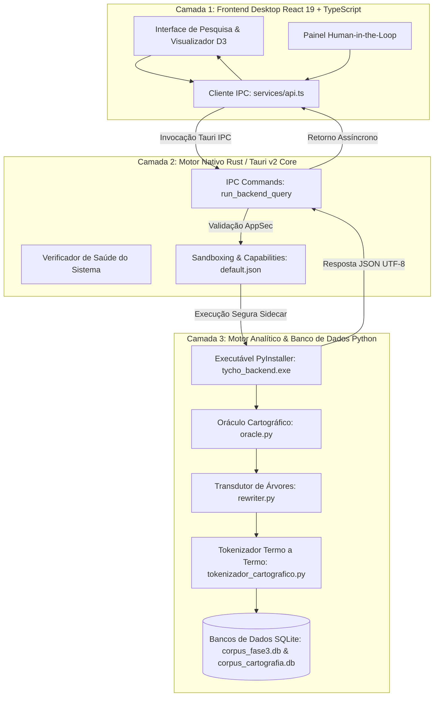

# Arquitetura do Sistema - Tycho Brahe Search

O **Tycho Brahe Search** foi arquitetado como uma aplicação tripartida de alta performance e desacoplamento modular, combinando o ecossistema nativo do **Rust (Tauri v2)**, o poder analítico de **Python (NLP, spaCy, NLTK, SQLite)** e uma interface moderna em **React 19 + TypeScript + Tailwind CSS + D3.js**.

---

## 1. Diagrama Geral de Camadas

---

## 2. Descrição das Camadas

### Camada 1: Frontend (React / TypeScript / Tailwind / D3)
- **Localização**: `tycho-desktop/src/`
- **Responsabilidade**: Renderização gráfica, visualizador interativo em árvore SVG com pan/zoom via D3, tabela termo a termo com badges cromáticas por domínio, e sistema de auditoria *Human-in-the-Loop*.
- **Comunicação**: Invoca os comandos do Tauri nativo de forma assíncrona com tipagem estrita TypeScript.

### Camada 2: Motor Rust (Tauri v2 Shell)
- **Localização**: `tycho-desktop/src-tauri/`
- **Responsabilidade**: Camada de orquestração do sistema operacional. Gerencia o ciclo de vida do processo Python Sidecar, aplica validações de segurança (AppSec) contra Self-DoS, controla a política estrita de *Content Security Policy* (CSP) e compila executáveis nativos com otimizações LTO (*Link-Time Optimization*).

### Camada 3: Motor Analítico Python (PyInstaller Sidecar)
- **Localização**: `python_backend/`
- **Responsabilidade**:
  - `oracle.py`: Classificador de traços cartográficos e diagnósticos estruturais.
  - `rewriter.py`: Transdutor recursivo que expande nós sintéticos (CP, IP, VP) na hierarquia dos 5 domínios.
  - `tokenizador_cartografico.py`: Extração de lema, classe morfológica (POS) e mapeamento de papéis gerativos universais.
  - `pesquisa_sintatica.py`: Roteador CLI de alta velocidade que consulta as bases SQLite indexadas com o *Nested Set Model* (lft/rgt).
