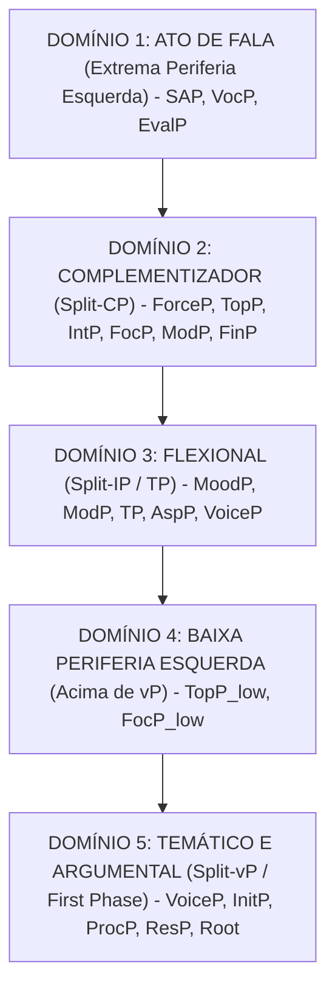

# Guia Teórico da Cartografia Sintática e os 5 Grandes Domínios

Este documento descreve o modelo teórico de Gramática Gerativa formal implementado no **Tycho Brahe Search**, fundamentado no Programa Cartográfico (*Cartographic Approach*) iniciado por Luigi Rizzi (1997, 2004), Guglielmo Cinque (1999), Adriana Belletti (2004), Gillian Ramchand (2008) e pesquisadores associados.

---

## 1. Fundamentos Teóricos

A abordagem tradicional de sintaxe gerativa representava a estrutura sentencial por meio de nós oracionais genéricos:
$$\text{CP} \longrightarrow \text{IP} \longrightarrow \text{VP}$$

No Programa Cartográfico, esses nós sintéticos foram decompostos em uma **hierarquia estrita e universal de dezenas de projeções funcionais**, permitindo o mapeamento fino de traços ilocucionários, informacionais, modais, temporais, aspectuais e argumentais.

---

## 2. A Hierarquia Universal dos 5 Grandes Domínios

### Domínio 1: O Domínio do Ato de Fala (Extrema Periferia Esquerda)
*Fundamentação: Speas & Tenny (2003), Hill (2007).*
Codifica a ancoragem pragmática e a relação de interlocução direta entre Falante (*Speaker*) e Ouvinte (*Hearer*):
1. **`SAP` (Speech Act Phrase)**: Codifica a força pragmática e a interação de fala.
2. **`VocP` (Vocative Phrase)**: Posição estrutural de ancoragem de vocativos e chamamentos (*Senhor*, *Ó Deus*).
3. **`EvalP / AttP` (Evaluative / Attitude Phrase)**: Ponto de ancoragem para atitudes expressivas do enunciador (*Francamente*, *Honestamente*).

---

### Domínio 2: O Domínio Complementizador (Split-CP)
*Fundamentação: Rizzi (1997, 2001, 2004).*
Interface entre a proposição e o contexto discursivo/oracional externo:
1. **`ForceP`**: Tipo ilocucionário da oração (declarativa, interrogativa, imperativa, exclamativa) e complementizadores matrizes (*que*).
2. **`TopP (Shift)*`**: Tópico discursivo de mudança ou contraste (*Aboutness-Shift Topic*).
3. **`IntP`**: Operador interrogativo de orações sim/não (*se*, *porventura*).
4. **`TopP (Familiar)*`**: Tópico familiar/dado no contexto compartilhado.
5. **`FocP`**: Foco contrastivo, clivadas e operadores *Wh-* interrogativos (*quem*, *o que*, *quando*).
6. **`ModP`**: Posição modificadora para advérbios da periferia esquerda (*rapidamente* pré-verbal focalizado).
7. **`QembP`**: Perguntas embutidas e subordinadas interrogativas indiretas.
8. **`FinP`**: Especificação de finitude (tempo finito vs infinitivo/gerúndio) e fronteira com o domínio flexional.

---

### Domínio 3: O Domínio Flexional (Split-IP / TP)
*Fundamentação: Cinque (1999).*
Hierarquia universal e estrita de projeções modais, temporais, aspectuais e de voz. O sistema impõe a seguinte ordenação invariante:
1. **`MoodP_speech-act`**: *francamente*, *honestamente*.
2. **`MoodP_evaluative`**: *felizmente*, *lamentavelmente*.
3. **`MoodP_evidential`**: *evidentemente*, *alegadamente*.
4. **`ModP_epistemic`**: *provavelmente*, *possivelmente*.
5. **`T_Past / T_Future`**: *então*, *amanhã*, *antigamente*.
6. **`MoodP_irrealis`**: *talvez*.
7. **`ModP_necessity`**: *necessariamente*, *obrigatoriamente*.
8. **`ModP_possibility`**: *possivelmente*.
9. **`ModP_volitional`**: *voluntariamente*, *de bom grado*.
10. **`ModP_obligation`**: *obrigatoriamente*.
11. **`ModP_ability/permission`**: *facilmente*, *livremente*.
12. **`AspP_habitual`**: *habitualmente*, *costumeiramente*.
13. **`T_Anterior`**: *já*, *outrora*.
14. **`AspP_terminative`**: *não mais*, *cessantemente*.
15. **`AspP_continuative`**: *ainda*, *continuamente*.
16. **`AspP_perfect`**: *sempre*, *nunca*.
17. **`AspP_retrospective`**: *recentemente*, *logo*.
18. **`AspP_proximative`**: *prestes a*, *quase*.
19. **`AspP_durative`**: *brevemente*, *longamente*.
20. **`AspP_progressive`**: *progressivamente*, *a passo e passo*.
21. **`AspP_prospective`**: *futuramente*, *em breve*.
22. **`AspP_completive`**: *completamente*, *de todo*.
23. **`VoiceP`**: *bem*, *mal* (Voz ativa, passiva, média).

---

### Domínio 4: A Baixa Periferia Esquerda
*Fundamentação: Belletti (2004).*
Zona informacional situada na borda superior do vP para ativação de constituintes no domínio pós-verbal:
1. **`TopP_low`**: Tópico baixo de ligação anafórica.
2. **`FocP_low`**: Foco informacional baixo / Sujeitos pós-verbais in situ (*Chegou [o rei]*).
3. **`TopP_low`**: Posição baixa de clíticos e elementos topicalizados internamente.

---

### Domínio 5: O Domínio Temático e Argumental (Split-vP / First Phase)
*Fundamentação: Ramchand (2008), Pylkkänen (2008), Harley (2013).*
Decomposição da micro-estrutura do evento verbal e atribuição de papéis temáticos:
1. **`VoiceP`**: Introdução do argumento externo / Iniciador / Agente.
2. **`InitP` (Initiation Phrase)**: Sub-evento que desencadeia a causalidade do evento.
3. **`ApplP_high` (High Applicative Phrase)**: Introdução de beneficiários / malfeitores externos.
4. **`ProcP` (Process Phrase)**: Núcleo dinâmico verbal / Processo em desenvolvimento.
5. **`ApplP_low` (Low Applicative Phrase)**: Introdução de recipient / posse / alvo interno.
6. **`ResP` (Result Phrase)**: Sub-evento de estado resultante ou telicidade.
7. **`Root / Path / Ground / Meas`**: Raiz lexical pura, trajetória e Tema/Paciente afetado.
